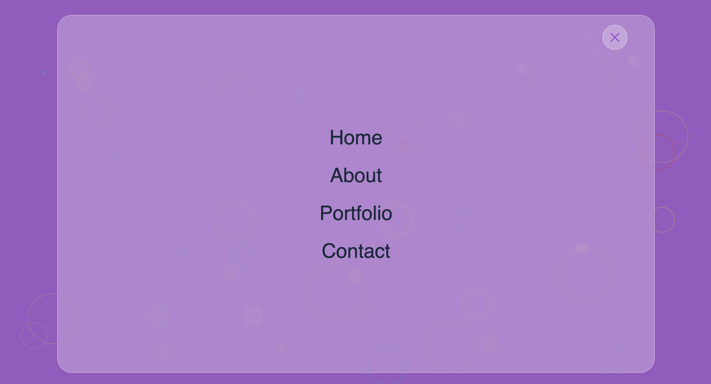
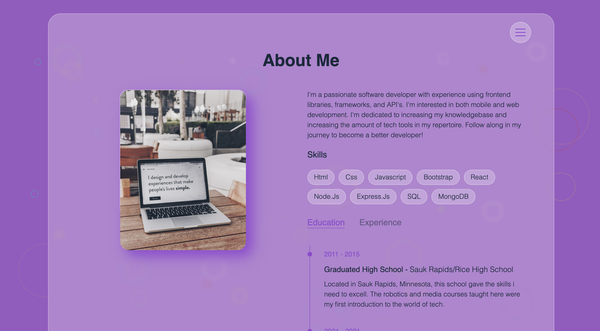

# Portfolio-Website

## Table of contents:

- [Description](#description)
- [Installation](#installation)
- [Usage](#usage)
- [Contributors](#contributors)
- [Questions](#questions)

### Description:

This is a responsive portfolio website that looks greate on all screen sizes. It features an animated SVG background, a clean looking menu for navigation, and links to all my deployed apps.

Screenshots of running program:  

Link to deployed website: https://aden-abdirahman.github.io/Portfolio-Website/

### Installation:

No need to install anything to use this app!

### Usage:

Example of how to use this program: You can use visit my deployed portfolio website at https://aden-abdirahman.github.io/Portfolio-Website/

### License:

This project is licensed under: MIT

### Contributors:

Abdirahman

### Questions:

If you have any questions contact Abdirahman on [Github](https://github.com/aden-abdirahman)
or [Email](https://aden.abdirahman45@gmail.com)
